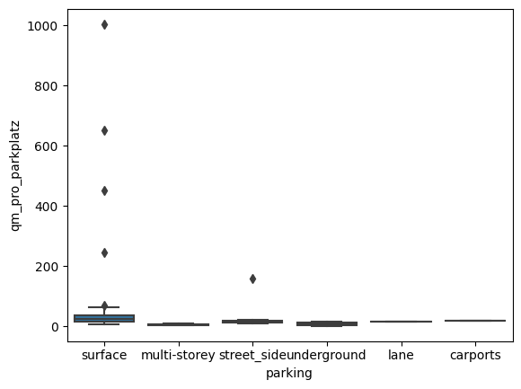
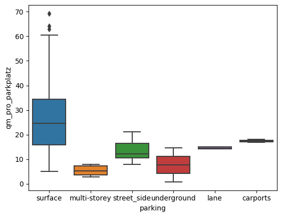

## Alle Parkplatz Flächen einer Stadt  

Wie man einzelne (Parkplatz) Flächen mittels Openstreetmap (OSM) und deren API berechnen kann, habe ich bereits [hier](pp_vermessen.html) gezeigt. Nun geht es darum alle Parkplatz Fächen einer Stadt zu berechnen. Dazu bedient man sich der [Overpass Api](http://overpass-api.de/). Diese ist ziemlich umfangreich, weshalb ich hier nur auf die für die Zwecke notwenigen Funktionen eingehen werde. Zunächst einmal benötigen wir die AreaID der Stadt. Dazu nutzen wir Nominatim, hierbei kann man eine OSM-Objekt ID über deren Namen suchen. In diesem Fall "Darmstadt, Germany":


```python
from OSMPythonTools.overpass import overpassQueryBuilder, Overpass, Nominatim
nominatim = Nominatim()
stadt = 'Darmstadt'
areaId = nominatim.query(f'{stadt}, Germany').areaId()
print(areaId)
```

    3600062581
    

Mit dieser Area ID kann man nun die Overpass Api bemühen. Dazu nutzen wir den QueryBuilder. Dort legen wir mit der `areaId` fest, in welchem Gebiet gesucht werden soll. Mit dem `elementType='way'` legen wir fest welche OSM-Objekte wir zurück bekommen wollen. Mit dem `selector` kann man innerhalb der OSM-Tags filtern. Mit `'"amenity"="parking"'` legen wir fest, dass wir nur "ways" haben wollen, die den entsprechenden Tag haben. Mit `includeGeometry=True` stellen wir sicher, dass wir auch die GPS-Koordinaten der Objekte erhalten. 


```python
overpass = Overpass()
query = overpassQueryBuilder(area=areaId, elementType='way', selector='"amenity"="parking"', includeGeometry=True)
result = overpass.query(query, timeout = 60)
```

Von den `result`s holen wir uns die Elemente als JSON bzw. Python Dict


```python
parkplaetze = result._json['elements']
display(parkplaetze[0])
```


    {'type': 'way',
     'id': 6913068,
     'bounds': {'minlat': 49.8571798,
      'minlon': 8.6438659,
      'maxlat': 49.8573311,
      'maxlon': 8.6441638},
     'nodes': [617551484, 617551488, 617551486, 617551494, 617551484],
     'geometry': [{'lat': 49.8572017, 'lon': 8.6438659},
      {'lat': 49.8571798, 'lon': 8.6441257},
      {'lat': 49.8573204, 'lon': 8.6441638},
      {'lat': 49.8573311, 'lon': 8.6438846},
      {'lat': 49.8572017, 'lon': 8.6438659}],
     'tags': {'amenity': 'parking', 'parking': 'surface', 'surface': 'asphalt'}}


Man erkennt schon, welche Informationen alles in den Dicts stecken. Neben der Way-ID und den Geokoordinaten, sind auch die Tags enthalten. Nun können wir die [hier](pp_vermessen.html) genutzten Funktionen verwenden, um alle Parkplätze zu vermessen. Darüber hinaus wollen wir uns noch zusätzliche Informationen zu den Parkplätzen abspeichern:


```python
from math import pi, cos, radians
import geopandas as gpd
from shapely.geometry import Polygon
import pandas as pd
def reproject(latitude, longitude):
    #https://stackoverflow.com/questions/4681737/how-to-calculate-the-area-of-a-polygon-on-the-earths-surface-using-python
    """Returns the x & y coordinates in meters using a sinusoidal projection"""

    earth_radius = 6371009 # in meters
    lat_dist = pi * earth_radius / 180.0

    y = [lat * lat_dist for lat in latitude]
    x = [long * lat_dist * cos(radians(lat)) 
                for lat, long in zip(latitude, longitude)]
    return x, y

def area_of_polygon(x, y):
    """Calculates the area of an arbitrary polygon given its verticies"""
    area = 0.0
    for i in range(-1, len(x)-1):
        area += x[i] * (y[i+1] - y[i-1])
    return abs(area) / 2.0
dfs = []
gesamtflaeche = 0
for p in parkplaetze:
    lats = []
    lons = []
    geom = p['geometry']
    for g in geom:
        lats.append(g['lat'])
        lons.append(g['lon'])
    x, y = reproject(lats,lons)
    x.append(x[0])
    y.append(y[0])
    ar = area_of_polygon(x,y)
    polygon_geom = Polygon(zip(lons, lats))
    
    df = {
        'id': p['id'],
        'flaeche_qm': ar,
        'geometry':polygon_geom
    }#, index = [p['id']]
    tags = p['tags']
    if 'surface' in tags.keys():
        df['oberflaeche'] = tags['surface']
    else:
        df['oberflaeche'] = None

    if 'access' in tags.keys():
        df['zugaenglich'] = tags['access']
    else:
        df['zugaenglich'] = None

    if 'capacity' in tags.keys():
        df['kapazitaet'] = tags['capacity']
    else:
        df['kapazitaet'] = None

    if 'capacity:disabled' in tags.keys():
        df['kapazitaet_behinderten'] = tags['capacity:disabled']
    else:
        df['kapazitaet_behinderten'] = None

    if 'fee' in tags.keys():
        df['gebuehr'] = tags['fee']
    else:
        df['gebuehr'] = None

    if 'parking' in tags.keys():
        df['parking'] = tags['parking']
    else:
        df['parking'] = None


    gdf = gpd.GeoDataFrame(df, crs="EPSG:4326", index = [None])
    dfs.append(gdf)
    gesamtflaeche += ar

df = pd.concat(dfs)

print('Die Gesamtfläche beträgt: ', gesamtflaeche, 'Quadratmeter')
```

    Die Gesamtfläche beträgt:  1046523.5981274489 Quadratmeter
    

Den erhaltenen Parkplatz schauen wir uns nun explorativ an:  


```python
df.head()
```


<div>
<style scoped>
    .dataframe tbody tr th:only-of-type {
        vertical-align: middle;
    }

    .dataframe tbody tr th {
        vertical-align: top;
    }

    .dataframe thead th {
        text-align: right;
    }
</style>
<table border="1" class="dataframe">
  <thead>
    <tr style="text-align: right;">
      <th></th>
      <th>id</th>
      <th>flaeche_qm</th>
      <th>geometry</th>
      <th>oberflaeche</th>
      <th>zugaenglich</th>
      <th>kapazitaet</th>
      <th>kapazitaet_behinderten</th>
      <th>gebuehr</th>
      <th>parking</th>
    </tr>
  </thead>
  <tbody>
    <tr>
      <th>None</th>
      <td>6913068</td>
      <td>293.702965</td>
      <td>POLYGON ((8.64387 49.85720, 8.64413 49.85718, ...</td>
      <td>asphalt</td>
      <td>None</td>
      <td>None</td>
      <td>None</td>
      <td>None</td>
      <td>surface</td>
    </tr>
    <tr>
      <th>None</th>
      <td>20312936</td>
      <td>1984.863035</td>
      <td>POLYGON ((8.68074 49.86026, 8.68097 49.86026, ...</td>
      <td>None</td>
      <td>yes</td>
      <td>None</td>
      <td>None</td>
      <td>yes</td>
      <td>surface</td>
    </tr>
    <tr>
      <th>None</th>
      <td>20312981</td>
      <td>1624.103809</td>
      <td>POLYGON ((8.67892 49.85958, 8.67988 49.85959, ...</td>
      <td>None</td>
      <td>yes</td>
      <td>None</td>
      <td>None</td>
      <td>no</td>
      <td>surface</td>
    </tr>
    <tr>
      <th>None</th>
      <td>22937260</td>
      <td>24850.706123</td>
      <td>POLYGON ((8.65994 49.88707, 8.66020 49.88745, ...</td>
      <td>None</td>
      <td>yes</td>
      <td>None</td>
      <td>None</td>
      <td>no</td>
      <td>surface</td>
    </tr>
    <tr>
      <th>None</th>
      <td>23110565</td>
      <td>64.274915</td>
      <td>POLYGON ((8.67368 49.86134, 8.67388 49.86134, ...</td>
      <td>None</td>
      <td>private</td>
      <td>None</td>
      <td>None</td>
      <td>Mo-Fr</td>
      <td>surface</td>
    </tr>
  </tbody>
</table>
</div>


```python
print('Oberflächen: ', df.oberflaeche.unique())
print('Zugänglich: ', df.zugaenglich.unique())
print('Kapazität: ', df.kapazitaet.unique())
print('Kapazität Behindertenparkplätze: ', df.kapazitaet_behinderten.unique())
print('Gebühr: ', df.gebuehr.unique())
print('Parking: ', df.parking.unique())
```

    Oberflächen:  ['asphalt' None 'unpaved' 'gravel' 'grass' 'compacted' 'paving_stones'
     'fine_gravel' 'paved' 'sand' 'cobblestone' 'concrete' 'grass_paver'
     'sett' 'ground']
    Zugänglich:  [None 'yes' 'private' 'no' 'customers' 'permissive' 'unknown' 'permit'
     'destination' 'restricted' 'designated']
    Kapazität:  [None '50' '468' '10' '54' '100' '700' '500' '841' '20' '45' '14' '17' '8'
     '15' '80' '40' '59' '2' '11' '7' '25' '12' '100+' '410' '178' '4' '6'
     '16' '5' '26' '49' '87' '38' '315' '9' '24' '1' '3' '29' '33' '21' '28'
     '0']
    Kapazität Behindertenparkplätze:  [None '2' '3' 'no' 'yes' '0' '1']
    Gebühr:  [None 'yes' 'no' 'Mo-Fr' '06:00-22:00' 'Private' 'Privat' 'not for public'
     'Mo-Sa 08:00-20:00' 'only for visitors'
     'mo-th 08:00-18:00;fr 08:00-16:00']
    Parking:  ['surface' None 'multi-storey' 'street_side' 'underground' 'lane'
     'carports']
    

Die Spalten Kapazität und Kapazität Behindertenparkplätze sind leider nicht durchgehend zahlen. Bei Kapazität haben wir einmal `100+` stehen, ansonsten sieht das sehr gut aus. Bei den Behindertenparkplätzen sieht das anders aus. Da sind neben Zahlen leider noch Texteingaben dabei. Ungewöhnlich ist jedoch auch, dass bei Kapazität scheinbar Einträge mit `0` sind. Schauen wir uns diese mal an:  


```python
df.query('kapazitaet == "0"')
```


<div>
<style scoped>
    .dataframe tbody tr th:only-of-type {
        vertical-align: middle;
    }

    .dataframe tbody tr th {
        vertical-align: top;
    }

    .dataframe thead th {
        text-align: right;
    }
</style>
<table border="1" class="dataframe">
  <thead>
    <tr style="text-align: right;">
      <th></th>
      <th>id</th>
      <th>flaeche_qm</th>
      <th>geometry</th>
      <th>oberflaeche</th>
      <th>zugaenglich</th>
      <th>kapazitaet</th>
      <th>kapazitaet_behinderten</th>
      <th>gebuehr</th>
      <th>parking</th>
    </tr>
  </thead>
  <tbody>
    <tr>
      <th>None</th>
      <td>1062717054</td>
      <td>24.127108</td>
      <td>POLYGON ((8.65473 49.88604, 8.65472 49.88601, ...</td>
      <td>paving_stones</td>
      <td>None</td>
      <td>0</td>
      <td>1</td>
      <td>no</td>
      <td>None</td>
    </tr>
  </tbody>
</table>
</div>


Es handelt sich also um den Parkplatz mit der ID [1062717054](https://www.openstreetmap.org/way/1062717054). Dieser hat somit lediglich einen Behindertenparkplatz. Man kann die beiden Werte somit zusammenrechnen um eine Gesamtanzahl an Parkplätzen bestimmen zu können. Dazu müssen wir zunächst einmal alle Parkplätze bestimmen, wo dies möglich ist: 


```python
def zahl_if_int(x):
    try:
        i = int(x)
        return i
    except:
        return 0

df['kapazitaet_cleaned'] = df.kapazitaet.apply(lambda x: zahl_if_int(x))
df['kapazitaet_behinderten_cleaned'] = df.kapazitaet_behinderten.apply(lambda x: zahl_if_int(x))
df['kapazitaet_gesamt'] = df['kapazitaet_cleaned'] + df['kapazitaet_behinderten_cleaned']

df['kapazitaet_gesamt'] = df.kapazitaet_gesamt.apply(lambda x: x if x>0 else None)
```


```python
df[df.kapazitaet_behinderten_cleaned >0]
```


<div>
<style scoped>
    .dataframe tbody tr th:only-of-type {
        vertical-align: middle;
    }

    .dataframe tbody tr th {
        vertical-align: top;
    }

    .dataframe thead th {
        text-align: right;
    }
</style>
<table border="1" class="dataframe">
  <thead>
    <tr style="text-align: right;">
      <th></th>
      <th>id</th>
      <th>flaeche_qm</th>
      <th>geometry</th>
      <th>oberflaeche</th>
      <th>zugaenglich</th>
      <th>kapazitaet</th>
      <th>kapazitaet_behinderten</th>
      <th>gebuehr</th>
      <th>parking</th>
      <th>kapazitaet_cleaned</th>
      <th>kapazitaet_behinderten_cleaned</th>
      <th>kapazitaet_gesamt</th>
    </tr>
  </thead>
  <tbody>
    <tr>
      <th>None</th>
      <td>25070878</td>
      <td>1306.243415</td>
      <td>POLYGON ((8.64622 49.81955, 8.64656 49.81960, ...</td>
      <td>None</td>
      <td>yes</td>
      <td>None</td>
      <td>2</td>
      <td>yes</td>
      <td>surface</td>
      <td>0</td>
      <td>2</td>
      <td>2.0</td>
    </tr>
    <tr>
      <th>None</th>
      <td>25501733</td>
      <td>1119.345563</td>
      <td>POLYGON ((8.64459 49.81589, 8.64498 49.81596, ...</td>
      <td>None</td>
      <td>customers</td>
      <td>54</td>
      <td>3</td>
      <td>no</td>
      <td>surface</td>
      <td>54</td>
      <td>3</td>
      <td>57.0</td>
    </tr>
    <tr>
      <th>None</th>
      <td>26947868</td>
      <td>2158.037885</td>
      <td>POLYGON ((8.65269 49.85894, 8.65322 49.85895, ...</td>
      <td>None</td>
      <td>yes</td>
      <td>50</td>
      <td>2</td>
      <td>yes</td>
      <td>surface</td>
      <td>50</td>
      <td>2</td>
      <td>52.0</td>
    </tr>
    <tr>
      <th>None</th>
      <td>161003301</td>
      <td>738.123973</td>
      <td>POLYGON ((8.63961 49.86678, 8.63969 49.86679, ...</td>
      <td>None</td>
      <td>customers</td>
      <td>None</td>
      <td>3</td>
      <td>no</td>
      <td>surface</td>
      <td>0</td>
      <td>3</td>
      <td>3.0</td>
    </tr>
    <tr>
      <th>None</th>
      <td>168765524</td>
      <td>300.825990</td>
      <td>POLYGON ((8.61313 49.86997, 8.61309 49.87007, ...</td>
      <td>cobblestone</td>
      <td>yes</td>
      <td>6</td>
      <td>2</td>
      <td>no</td>
      <td>surface</td>
      <td>6</td>
      <td>2</td>
      <td>8.0</td>
    </tr>
    <tr>
      <th>None</th>
      <td>168765525</td>
      <td>281.913377</td>
      <td>POLYGON ((8.61239 49.86997, 8.61241 49.86992, ...</td>
      <td>cobblestone</td>
      <td>yes</td>
      <td>8</td>
      <td>2</td>
      <td>no</td>
      <td>surface</td>
      <td>8</td>
      <td>2</td>
      <td>10.0</td>
    </tr>
    <tr>
      <th>None</th>
      <td>175005084</td>
      <td>20.457238</td>
      <td>POLYGON ((8.65291 49.86091, 8.65291 49.86087, ...</td>
      <td>None</td>
      <td>customers</td>
      <td>2</td>
      <td>2</td>
      <td>no</td>
      <td>surface</td>
      <td>2</td>
      <td>2</td>
      <td>4.0</td>
    </tr>
    <tr>
      <th>None</th>
      <td>240040987</td>
      <td>904.012331</td>
      <td>POLYGON ((8.66339 49.85070, 8.66351 49.85070, ...</td>
      <td>gravel</td>
      <td>yes</td>
      <td>None</td>
      <td>2</td>
      <td>no</td>
      <td>surface</td>
      <td>0</td>
      <td>2</td>
      <td>2.0</td>
    </tr>
    <tr>
      <th>None</th>
      <td>272385673</td>
      <td>1004.889956</td>
      <td>POLYGON ((8.63366 49.87002, 8.63365 49.87005, ...</td>
      <td>None</td>
      <td>yes</td>
      <td>None</td>
      <td>1</td>
      <td>Mo-Sa 08:00-20:00</td>
      <td>surface</td>
      <td>0</td>
      <td>1</td>
      <td>1.0</td>
    </tr>
    <tr>
      <th>None</th>
      <td>273324403</td>
      <td>977.242373</td>
      <td>POLYGON ((8.65615 49.86643, 8.65655 49.86649, ...</td>
      <td>asphalt</td>
      <td>yes</td>
      <td>38</td>
      <td>1</td>
      <td>no</td>
      <td>surface</td>
      <td>38</td>
      <td>1</td>
      <td>39.0</td>
    </tr>
    <tr>
      <th>None</th>
      <td>304791471</td>
      <td>631.580695</td>
      <td>POLYGON ((8.63775 49.87190, 8.63795 49.87131, ...</td>
      <td>grass_paver</td>
      <td>private</td>
      <td>15</td>
      <td>3</td>
      <td>None</td>
      <td>surface</td>
      <td>15</td>
      <td>3</td>
      <td>18.0</td>
    </tr>
    <tr>
      <th>None</th>
      <td>365215866</td>
      <td>157.409982</td>
      <td>POLYGON ((8.65385 49.87803, 8.65390 49.87796, ...</td>
      <td>None</td>
      <td>private</td>
      <td>None</td>
      <td>1</td>
      <td>None</td>
      <td>street_side</td>
      <td>0</td>
      <td>1</td>
      <td>1.0</td>
    </tr>
    <tr>
      <th>None</th>
      <td>568999896</td>
      <td>43.241803</td>
      <td>POLYGON ((8.63102 49.87322, 8.63113 49.87322, ...</td>
      <td>None</td>
      <td>yes</td>
      <td>None</td>
      <td>2</td>
      <td>yes</td>
      <td>surface</td>
      <td>0</td>
      <td>2</td>
      <td>2.0</td>
    </tr>
    <tr>
      <th>None</th>
      <td>875704042</td>
      <td>74.429437</td>
      <td>POLYGON ((8.63279 49.86725, 8.63301 49.86728, ...</td>
      <td>None</td>
      <td>customers</td>
      <td>6</td>
      <td>3</td>
      <td>no</td>
      <td>surface</td>
      <td>6</td>
      <td>3</td>
      <td>9.0</td>
    </tr>
    <tr>
      <th>None</th>
      <td>1062717054</td>
      <td>24.127108</td>
      <td>POLYGON ((8.65473 49.88604, 8.65472 49.88601, ...</td>
      <td>paving_stones</td>
      <td>None</td>
      <td>0</td>
      <td>1</td>
      <td>no</td>
      <td>None</td>
      <td>0</td>
      <td>1</td>
      <td>1.0</td>
    </tr>
    <tr>
      <th>None</th>
      <td>1103107443</td>
      <td>31.733052</td>
      <td>POLYGON ((8.65660 49.91144, 8.65657 49.91140, ...</td>
      <td>None</td>
      <td>None</td>
      <td>2</td>
      <td>2</td>
      <td>no</td>
      <td>street_side</td>
      <td>2</td>
      <td>2</td>
      <td>4.0</td>
    </tr>
    <tr>
      <th>None</th>
      <td>1112885914</td>
      <td>31.016111</td>
      <td>POLYGON ((8.63262 49.86608, 8.63253 49.86607, ...</td>
      <td>paving_stones</td>
      <td>private</td>
      <td>2</td>
      <td>1</td>
      <td>no</td>
      <td>street_side</td>
      <td>2</td>
      <td>1</td>
      <td>3.0</td>
    </tr>
    <tr>
      <th>None</th>
      <td>1126800756</td>
      <td>581.238351</td>
      <td>POLYGON ((8.63891 49.87099, 8.63892 49.87094, ...</td>
      <td>paving_stones</td>
      <td>yes</td>
      <td>20</td>
      <td>2</td>
      <td>mo-th 08:00-18:00;fr 08:00-16:00</td>
      <td>None</td>
      <td>20</td>
      <td>2</td>
      <td>22.0</td>
    </tr>
  </tbody>
</table>
</div>


In wie vielen Fällen ist nun die Kapazität mit angegeben?


```python
print(len(df[~df.kapazitaet_gesamt.isna()]), 'von', len(df), 'haben eine Kapazität angegeben')
```

    138 von 856 haben eine Kapazität angegeben
    


```python
df['hat_kapazitaet'] = ~df.kapazitaet_gesamt.isna()
```

Wie ist die Angabe der Kapazität zwischen den Parkings verteilt?  
Dazu schauen wir uns zunächst an, wie häufig die einzelnen Parking Arten vorkommen:


```python
df.groupby('parking').size()
```


    parking
    carports          3
    lane              8
    multi-storey     35
    street_side      57
    surface         579
    underground      16
    dtype: int64


Nun wollen wir wissen zu welchem Anteil die Kapazität bei den Parking Arten mit angegeben ist. Man sieht, dass es bei Carports und Lanes den deutlich höchsten Anteil haben. Jedoch sind das auch die beiden Parking Arten, die es am seltensten gibt. Bei den restlichen Arten von Parking sind ist die Kapazität in etwa zum gleichen Anteil angegeben. 


```python
df.groupby('parking').hat_kapazitaet.mean()
```


    parking
    carports        0.666667
    lane            0.625000
    multi-storey    0.171429
    street_side     0.122807
    surface         0.177893
    underground     0.125000
    Name: hat_kapazitaet, dtype: float64


Mit diesen Informationen können wir nun berechnen wie viel Quadratmeter pro Parkplatz je nach Parking Art belegt werden


```python
df['qm_pro_parkplatz'] = df.flaeche_qm / df.kapazitaet_gesamt
```


```python
df.groupby('parking').qm_pro_parkplatz.mean()
```


    parking
    carports        17.424041
    lane            14.584434
    multi-storey     5.434023
    street_side     34.130573
    surface         48.585351
    underground      7.751612
    Name: qm_pro_parkplatz, dtype: float64


Das wirkt gerade bei Surface und street_side etwas viel. Ein Blick auf den Boxplot zeigt, dass einige Ausreißer den Schnitt nach oben ziehen. 


```python
import seaborn as sn
sn.boxplot(df, x = 'parking', y = 'qm_pro_parkplatz')
```


    


Im nächsten Schritt ist etwas Handarbeit gefragt. Entweder man schließt pauschal alle Parkplätze über 40 qm/Parkplatz aus der Berechnung aus (setzt die Kapazität auf NA) oder man geht einmal händisch drüber. Da es sich um nur etwa 20 Parkplätze handelt bin ich die Liste einmal durchgegangen: 


```python
df[(df['qm_pro_parkplatz'] > 40)][['id', 'parking', 'kapazitaet',
                                   'kapazitaet_behinderten', 'kapazitaet_gesamt', 'qm_pro_parkplatz']]
```


<div>
<style scoped>
    .dataframe tbody tr th:only-of-type {
        vertical-align: middle;
    }

    .dataframe tbody tr th {
        vertical-align: top;
    }

    .dataframe thead th {
        text-align: right;
    }
</style>
<table border="1" class="dataframe">
  <thead>
    <tr style="text-align: right;">
      <th></th>
      <th>id</th>
      <th>parking</th>
      <th>kapazitaet</th>
      <th>kapazitaet_behinderten</th>
      <th>kapazitaet_gesamt</th>
      <th>qm_pro_parkplatz</th>
    </tr>
  </thead>
  <tbody>
    <tr>
      <th>None</th>
      <td>25000932</td>
      <td>surface</td>
      <td>10</td>
      <td>None</td>
      <td>10.0</td>
      <td>54.985588</td>
    </tr>
    <tr>
      <th>None</th>
      <td>25070878</td>
      <td>surface</td>
      <td>None</td>
      <td>2</td>
      <td>2.0</td>
      <td>653.121707</td>
    </tr>
    <tr>
      <th>None</th>
      <td>26005087</td>
      <td>surface</td>
      <td>100</td>
      <td>None</td>
      <td>100.0</td>
      <td>43.189144</td>
    </tr>
    <tr>
      <th>None</th>
      <td>26947868</td>
      <td>surface</td>
      <td>50</td>
      <td>2</td>
      <td>52.0</td>
      <td>41.500729</td>
    </tr>
    <tr>
      <th>None</th>
      <td>28372234</td>
      <td>surface</td>
      <td>20</td>
      <td>None</td>
      <td>20.0</td>
      <td>54.634593</td>
    </tr>
    <tr>
      <th>None</th>
      <td>49363757</td>
      <td>surface</td>
      <td>50</td>
      <td>None</td>
      <td>50.0</td>
      <td>60.408696</td>
    </tr>
    <tr>
      <th>None</th>
      <td>143830667</td>
      <td>surface</td>
      <td>40</td>
      <td>None</td>
      <td>40.0</td>
      <td>46.110119</td>
    </tr>
    <tr>
      <th>None</th>
      <td>146657539</td>
      <td>surface</td>
      <td>12</td>
      <td>None</td>
      <td>12.0</td>
      <td>52.453606</td>
    </tr>
    <tr>
      <th>None</th>
      <td>161003301</td>
      <td>surface</td>
      <td>None</td>
      <td>3</td>
      <td>3.0</td>
      <td>246.041324</td>
    </tr>
    <tr>
      <th>None</th>
      <td>164711184</td>
      <td>surface</td>
      <td>4</td>
      <td>None</td>
      <td>4.0</td>
      <td>69.260474</td>
    </tr>
    <tr>
      <th>None</th>
      <td>174998314</td>
      <td>surface</td>
      <td>16</td>
      <td>None</td>
      <td>16.0</td>
      <td>54.119579</td>
    </tr>
    <tr>
      <th>None</th>
      <td>178129090</td>
      <td>surface</td>
      <td>14</td>
      <td>None</td>
      <td>14.0</td>
      <td>51.436515</td>
    </tr>
    <tr>
      <th>None</th>
      <td>179052619</td>
      <td>surface</td>
      <td>10</td>
      <td>None</td>
      <td>10.0</td>
      <td>62.911981</td>
    </tr>
    <tr>
      <th>None</th>
      <td>240040987</td>
      <td>surface</td>
      <td>None</td>
      <td>2</td>
      <td>2.0</td>
      <td>452.006166</td>
    </tr>
    <tr>
      <th>None</th>
      <td>272385673</td>
      <td>surface</td>
      <td>None</td>
      <td>1</td>
      <td>1.0</td>
      <td>1004.889956</td>
    </tr>
    <tr>
      <th>None</th>
      <td>273387843</td>
      <td>surface</td>
      <td>5</td>
      <td>None</td>
      <td>5.0</td>
      <td>44.665927</td>
    </tr>
    <tr>
      <th>None</th>
      <td>301447423</td>
      <td>surface</td>
      <td>6</td>
      <td>None</td>
      <td>6.0</td>
      <td>45.184387</td>
    </tr>
    <tr>
      <th>None</th>
      <td>304791472</td>
      <td>surface</td>
      <td>9</td>
      <td>None</td>
      <td>9.0</td>
      <td>64.190659</td>
    </tr>
    <tr>
      <th>None</th>
      <td>365215866</td>
      <td>street_side</td>
      <td>None</td>
      <td>1</td>
      <td>1.0</td>
      <td>157.409982</td>
    </tr>
    <tr>
      <th>None</th>
      <td>629494983</td>
      <td>None</td>
      <td>2</td>
      <td>None</td>
      <td>2.0</td>
      <td>100.109693</td>
    </tr>
    <tr>
      <th>None</th>
      <td>848842518</td>
      <td>surface</td>
      <td>25</td>
      <td>None</td>
      <td>25.0</td>
      <td>46.674932</td>
    </tr>
    <tr>
      <th>None</th>
      <td>989888662</td>
      <td>surface</td>
      <td>25</td>
      <td>None</td>
      <td>25.0</td>
      <td>41.942532</td>
    </tr>
    <tr>
      <th>None</th>
      <td>1009653948</td>
      <td>surface</td>
      <td>28</td>
      <td>None</td>
      <td>28.0</td>
      <td>52.747887</td>
    </tr>
  </tbody>
</table>
</div>


Bei den krassesten Ausreißern erkennt man ein Muster: Hier sind lediglich die Anzahl der Behindertenparkplätze eingetragen. Die restlichen nicht. Diese müssen also ausgeschlossen werden. 


```python
behalten = [
    26947868,
    28372234,
    143830667,
    146657539,
    164711184,
    174998314,
    178129090,
    179052619,
    273387843,
    304791472,
    848842518,
    989888662,
]

df.kapazitaet_gesamt = df.apply(lambda x: x.kapazitaet_gesamt if x.kapazitaet is not None else None,axis = 1)
df['qm_pro_parkplatz'] = df.flaeche_qm / df.kapazitaet_gesamt
```


```python
sn.boxplot(df, x = 'parking', y = 'qm_pro_parkplatz')
```

    

    


Das sieht jetzt viel besser aus. Man erkennt starke Unterschiede im Flächenverbrauch pro Parkplatz zwischen all den Parking Typen. So nimmt Surface im Median über 24 qm Fläche ein, wohingegend multi-storey auf etwa 5 qm kommt. Gerade beim Typ Surface erscheint der Median doch recht hoch, spricht man doch häufig davon, dass ein parkendes Auto den Platz eines Kinderzimmers beansprucht und meint damit meist 10-15 qm. Jedoch kommt der Wert gut hin, wenn man folgendes betrachtet: Ein Parkplatz ist in der Regel 2,5 m breit und 5 m lang (die breite der weißen Begrenzungsstreifen werden vernachlässigt). Dazu kommen nochmal 5 m Fahrbahnbreite zum Ein- und Ausparken. Stellt man sich nun zwei gegenüberliegende Parkplätze vor, so haben diese eine Breite von 2,5 m und eine Länge von 15 m (zwei mal 5 m Parkplatzlänge und ein mal die Breite der Fahrbahn). So kommt man auf 37,5 qm Fläche für zwei Parkplätze, das macht 18,75 qm pro Parkplatz. Das ist somit das Mindestmaß an Fläche für einen Parkplatz des Typs Surface. Somit überrascht es eher, dass es so viele Parkplätze des Typs unter 18 qm gibt. Schließlich kommen bei größeren Parkplätzen ja noch Flächen für Begrünungsstreifen, Laternen, Fußgängerwege etc. hinzu. Dazu ist ja nicht jede Ecke optimal ausgenutzt. 

Multi-Storey und Underground sind effizienter, weil einerseits über mehrere Stockwerke verteilt. Somit werden die parkenden Autos quasi gestapelt. Andererseits sind diese häufig kommerziell betrieben. Somit werden die Flächen sicherlich optimaler ausgenutzt, da hier Fläche = Geld ist. 

Die Daten können nun für eine weitere Verwendung zunächst gespeichert werden


```python
df.to_csv('darmstadt_parkplaetze.csv', index = False)
```

Zudem kann mit dem Paket folium eine Karte mit allen gefundenen Parkplätzen und deren Größe geplottet werden. Das Ergebnis ist [hier](./maps/Darmstadt.html) zu sehen


```python
import folium
```


```python
m = folium.Map(location=[49.8714, 8.6833], zoom_start=12, tiles='OpenStreetMap')

for _, r in df.iterrows():
    geo_j = r['geometry']
    fcol = 'red'
    if r['parking'] is not None:
        if (r['parking'] == 'multi-storey') or  (r['parking'] == 'underground'):
            fcol = 'green'
    geo_j = folium.GeoJson(data=geo_j,
                           style_function=lambda x: {'fillColor': fcol, 'lineColor': fcol})

    txt = "Flaeche: " + str(round(r['flaeche_qm'], 0) )+ 'qm\n' + 'parking: ' + str(r['parking'])
    folium.Popup(txt).add_to(geo_j)
    geo_j.add_to(m)

m.save(f'maps/{stadt}.html')
```


```python

```
