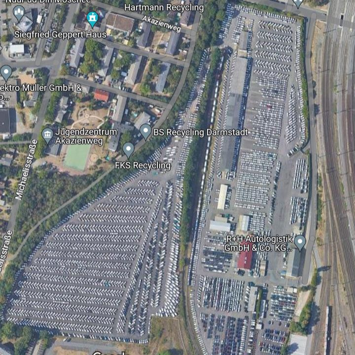
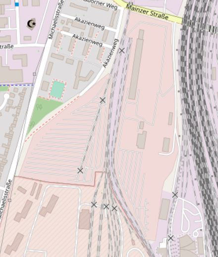
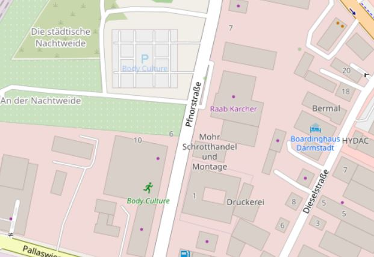
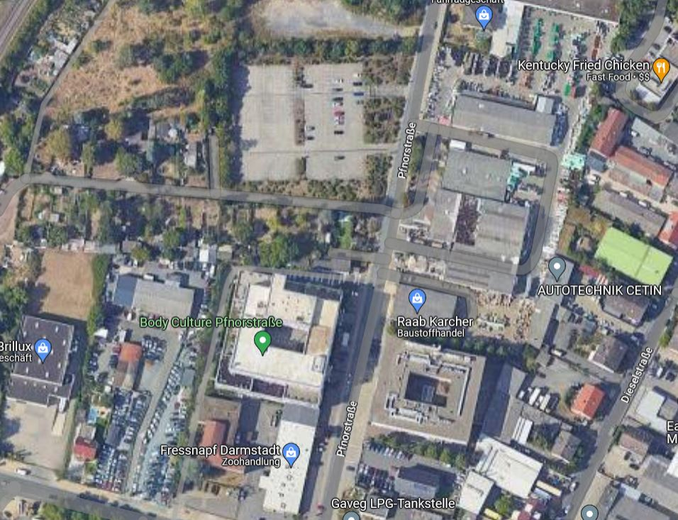
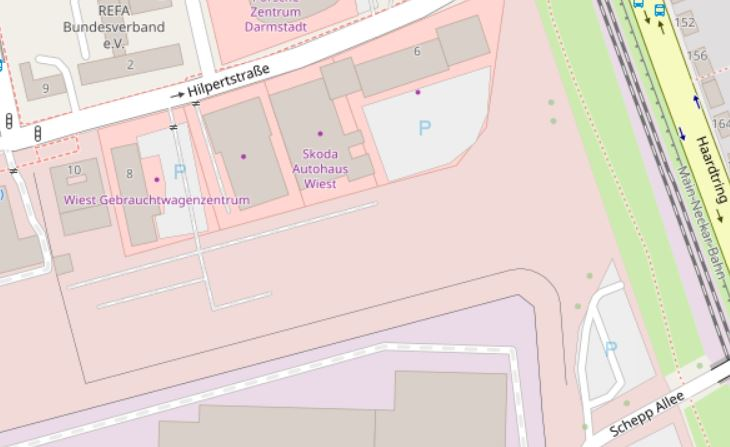
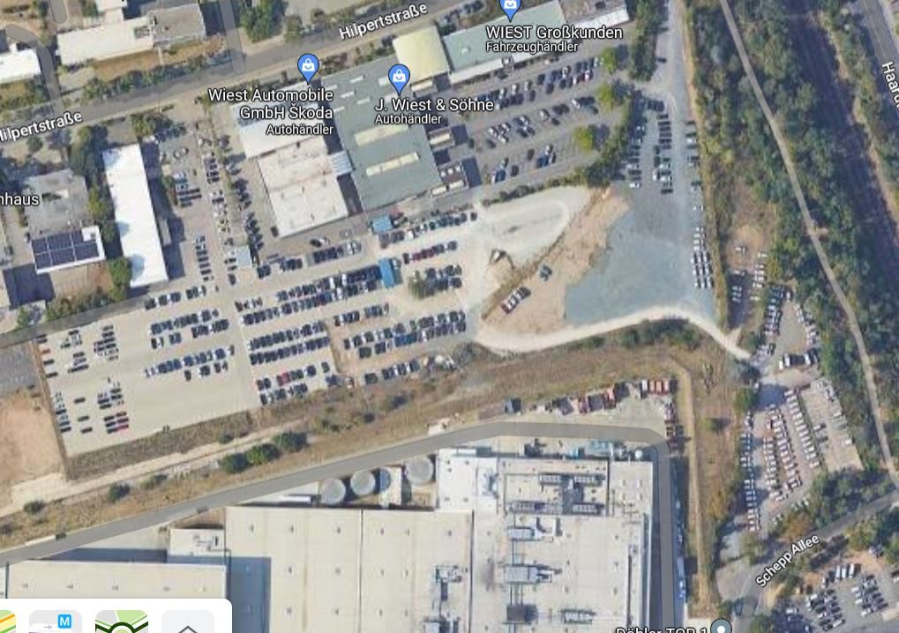

Es ist bekannt, dass Autos recht viel Platz in einer Stadt einnehmen. Jedoch ist auf den ersten Blick nicht bewusst wie viel genau. Um diese Frage zu beantworten, kann man alle (eingepflegten) Parkplätze einer Stadt in Openstreetmaps ausfindigt machen und vermessen. Wie das geht habe ich [hier](./alle.html) für Darmstadt gezeigt. Nun wollen wir uns die Daten mal genauer ansehen und ins Verhältnis setzen.  
Zunächst schauen wir uns die Daten an und gucken, welche Parkplätze ermittelt wurden und welche nicht. 


```python
import pandas as pd
```


```python
df = pd.read_csv('darmstadt_parkplaetze.csv')
df.head()
```


<div>
<style scoped>
    .dataframe tbody tr th:only-of-type {
        vertical-align: middle;
    }

    .dataframe tbody tr th {
        vertical-align: top;
    }

    .dataframe thead th {
        text-align: right;
    }
</style>
<table border="1" class="dataframe">
  <thead>
    <tr style="text-align: right;">
      <th></th>
      <th>id</th>
      <th>flaeche_qm</th>
      <th>geometry</th>
      <th>oberflaeche</th>
      <th>zugaenglich</th>
      <th>kapazitaet</th>
      <th>kapazitaet_behinderten</th>
      <th>gebuehr</th>
      <th>parking</th>
      <th>kapazitaet_cleaned</th>
      <th>kapazitaet_behinderten_cleaned</th>
      <th>kapazitaet_gesamt</th>
      <th>hat_kapazitaet</th>
      <th>qm_pro_parkplatz</th>
    </tr>
  </thead>
  <tbody>
    <tr>
      <th>0</th>
      <td>6913068</td>
      <td>293.702965</td>
      <td>POLYGON ((8.6438659 49.8572017, 8.6441257 49.8...</td>
      <td>asphalt</td>
      <td>NaN</td>
      <td>NaN</td>
      <td>NaN</td>
      <td>NaN</td>
      <td>surface</td>
      <td>0</td>
      <td>0</td>
      <td>NaN</td>
      <td>False</td>
      <td>NaN</td>
    </tr>
    <tr>
      <th>1</th>
      <td>20312936</td>
      <td>1984.863035</td>
      <td>POLYGON ((8.6807411 49.8602629, 8.6809715 49.8...</td>
      <td>NaN</td>
      <td>yes</td>
      <td>NaN</td>
      <td>NaN</td>
      <td>yes</td>
      <td>surface</td>
      <td>0</td>
      <td>0</td>
      <td>NaN</td>
      <td>False</td>
      <td>NaN</td>
    </tr>
    <tr>
      <th>2</th>
      <td>20312981</td>
      <td>1624.103809</td>
      <td>POLYGON ((8.6789243 49.8595831, 8.6798798 49.8...</td>
      <td>NaN</td>
      <td>yes</td>
      <td>NaN</td>
      <td>NaN</td>
      <td>no</td>
      <td>surface</td>
      <td>0</td>
      <td>0</td>
      <td>NaN</td>
      <td>False</td>
      <td>NaN</td>
    </tr>
    <tr>
      <th>3</th>
      <td>22937260</td>
      <td>24850.706123</td>
      <td>POLYGON ((8.6599385 49.8870735, 8.6602006 49.8...</td>
      <td>NaN</td>
      <td>yes</td>
      <td>NaN</td>
      <td>NaN</td>
      <td>no</td>
      <td>surface</td>
      <td>0</td>
      <td>0</td>
      <td>NaN</td>
      <td>False</td>
      <td>NaN</td>
    </tr>
    <tr>
      <th>4</th>
      <td>23110565</td>
      <td>64.274915</td>
      <td>POLYGON ((8.6736761 49.8613437, 8.6738834 49.8...</td>
      <td>NaN</td>
      <td>private</td>
      <td>NaN</td>
      <td>NaN</td>
      <td>Mo-Fr</td>
      <td>surface</td>
      <td>0</td>
      <td>0</td>
      <td>NaN</td>
      <td>False</td>
      <td>NaN</td>
    </tr>
  </tbody>
</table>
</div>


Wir haben also für jeden Parkplatz die Größe in Quadratmetern und die Kapazität, wobei diese 0 ist, wenn keine Kapazität angegeben ist. Die gefundenen Parkplätze kann man auf [dieser Karte](./assets/maps/Darmstadt.html) betrachten. Man sieht die vielen kleineren und größeren Parkplätze. Es sind sogar einige Waldparkplätze eingepflegt und somit gefunden. Was jedoch auffällt, ist dass die Fläche des Autologistikers neben dem Hauptbahnhof nicht als Parkplatz vermertk ist:  

In Openstreetmap sieht das wie folgt aus:  


Diese große, für Autos reservierte, Fläche in zentraler Lage ist somit nicht als Parkplatz gelistet. Auch wenn man es als Abstellfläche für Autos nutzt, kann man verstehen, dass es nicht als Parkplatz in Openstreetmap gelistet ist. Schließlich ist das eher eine Lagerfläche für Autos und diese stehen da oft so dicht beieinander, dass einzelne Fahrzeuge nicht raus können, ohne dass mehrere andere zuerst wegfahren.  

Beim näheren betrachten sind aber einige Flächen aufgefallen, die wohl Parkplätze sind aber nicht als solche bei OSM gepfelgt wurden. Beispielsweise ist im folgenden Ausschnitt nur ein Parkplatz gelistet.  
  
Obwohl es im Satelitenbild mehrere gibt. Man achte auf die Flächen unten links und oben rechts.  


Ähnlich verhält es sich im nächsten Ausschnitt. Hier sind zwei Parkflächen gepflegt.  
  
Aber ein Großteil der Fläche ist scheinbar ein Parkplatz.  


Das heißt in Openstreetmap sind nicht alle Parkplätze auch als solche gekennzeichnet. Für die weiteren Aussagen gilt es also zu beachten, dass man eher einen unteren Schätzer der Parkplatzflächen bestimmen kann. Doch wie groß ist nun die Gesamtfläche? Dazu betrachtet man alle Parkplätze außer die im Untergrund, da diese keine Oberfläche beanspruchen.


```python
gesamtoberflaeche = df[df.parking != 'underground'].flaeche_qm.sum() 
print(round(gesamtoberflaeche/ 10**6, 3), 'qkm')
```

    1.024 qkm
    

Über ein Quadratkilometer! Das kann man sich natürlich nicht so gut vorstellen. Deshalb kann man das mit anderen, den Heinern bekannten Flächen vergleichen:  

Das [Johannesviertel](https://de.wikipedia.org/wiki/Darmstadt-Johannesviertel) (0,383 km²) und [Martinsviertel](https://de.wikipedia.org/wiki/Darmstadt-Martinsviertel) (0,67 km²) haben zusammen 1,053 km². Also nur etwas mehr als die in OSM vermerkten Parkplätze in Darmstadt. Dort wohnen mehr als 17.000 Einwohner, es gibt zahlreiche Läden, Gastronomische Angebote, Schulen, Kirchen, Kindergärten etc. 17.000 Einwohner heißt mehr als 10% der Bevölkerung Darmstadt!   
Natürlich darf bei einer Flächenangabe nie die Umrechnung in Fußballfelder fehlen. Da diese auch nicht komplett gleich groß sind, nehme ich das berühmteste Fußballfeld Darmstadt:  


```python
# Stadion am Böllenfalltor Spielfeld:
svd = 105 * 68 # qm
print('Anzahl Spielflächen sv98: ', gesamtoberflaeche/svd)
```

    Anzahl Spielflächen sv98:  143.42483801831708
    

Über 143 Fußballfelder werden in Darmstadt also nur zum abstellen von Kraftfahrzeugen vorgehalten. Und das sind nur die in OSM vermerkten. Straßen- und illegales Gehwegparken sind da noch nicht betrachtet.  
Das heißt auf der Fläche, die in Darmstadt nur für das Abstellen von Kraftfahrzeugen reserviert ist, könnte man mehr als 10% der Einwohner inklusive Infrastruktur bringen.  
Natürlich kann man nicht aus jedem Parkplatz ein Wohngebäude machen. Doch was man auf fast jedem Parkplatz installieren könnte sind PV-Anlagen. Wie viel Energie würde das bringen? Laut https://www.gpm-webgis-12.de/geoapp/frames/index_ext2.php?gui_id=hessen_sod_03 bekommt man pro 1000 qm 155470 kWh pro Jahr an Energie (gemessen auf dem Luisenplatz)


```python
kwh_pro_qm = 155470/1000
energie_kwh = df[df.parking != 'underground'].flaeche_qm.sum() * kwh_pro_qm
print('Auf den Parkflächen könnte man so viel Energie pro Jahr erzeugen:')
print( energie_kwh / 10**6, 'GWh')
```

    Auf den Parkflächen könnte man so viel Energie pro Jahr erzeugen:
    159.2095733062934 GWh
    


```python
energie_kwh/160000 # Pro Einwohner
```


    995.0598331643338


Das wären fast 1000 kWh pro Bürger! Viele dürften so viel nicht mal im Jahr verbrauchen. 

Zum Schluss noch ein Lichtblick: Das sind die fünf größten Parkplätze der Stadt: 


```python
df5 = df[['id', 'flaeche_qm']].sort_values('flaeche_qm', ascending = False).head(5)
txt = df5.apply(lambda x: 'https://openstreetmap.org/way/' + str(int(x.id)) + ' mit einer Fläche von ' + str(x.flaeche_qm) +'qm', axis = 1)
for t in txt:
    print(t)
```

    https://openstreetmap.org/way/150055343 mit einer Fläche von 55365.8960958384qm
    https://openstreetmap.org/way/23385185 mit einer Fläche von 39253.1210534703qm
    https://openstreetmap.org/way/196675229 mit einer Fläche von 36739.41783049144qm
    https://openstreetmap.org/way/22937260 mit einer Fläche von 24850.70612310618qm
    https://openstreetmap.org/way/272245531 mit einer Fläche von 13560.987944384571qm
    

Platz 1 und 3 sind Mitarbeiterparkplätze von Merck. Aufgrund der Nähe zum Chemiewerk sind diese ohnehin nicht geeignet für den Wohnungsbau. Die Plätze 2 (Messplatz) und 5 (Marienplatz) werden jedoch in naher Zukunft zu Wohnquartieren. Auf dem [Messplatz](https://www.bauvereinag.de/unternehmen/presse/neues-quartier-auf-dem-messplatz) entstehen 560 Wohnungen, eine Kita und 8000qm Gewerbefläche und auf dem [Marienplatz](https://marienplatz-darmstadt.de/) nochmal 320 Wohnungen. Auf den Websites sind jeweils Quadratmeterzahlen angegeben die nur leicht höher sind als die hier angegebenen Flächen. 


```python

```
